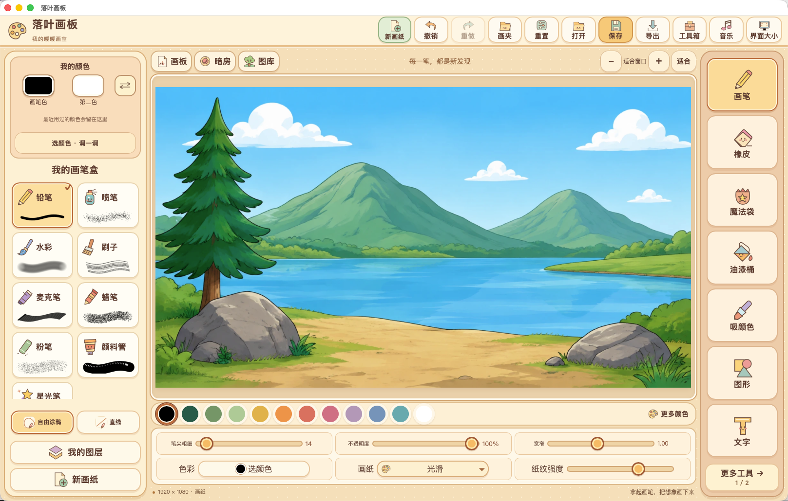
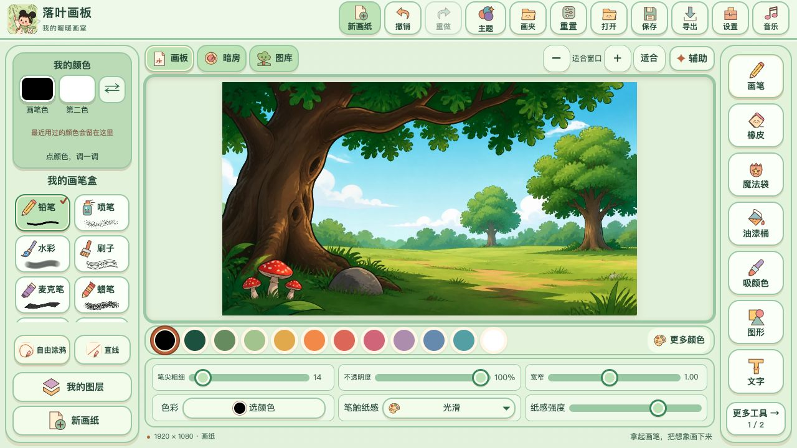
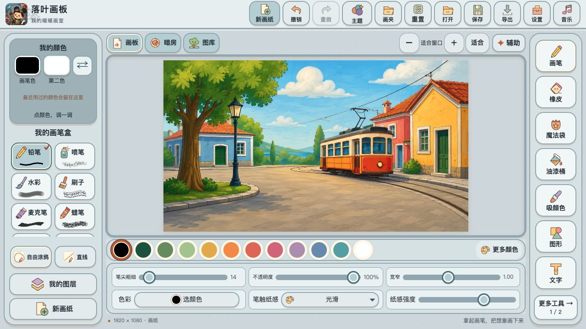
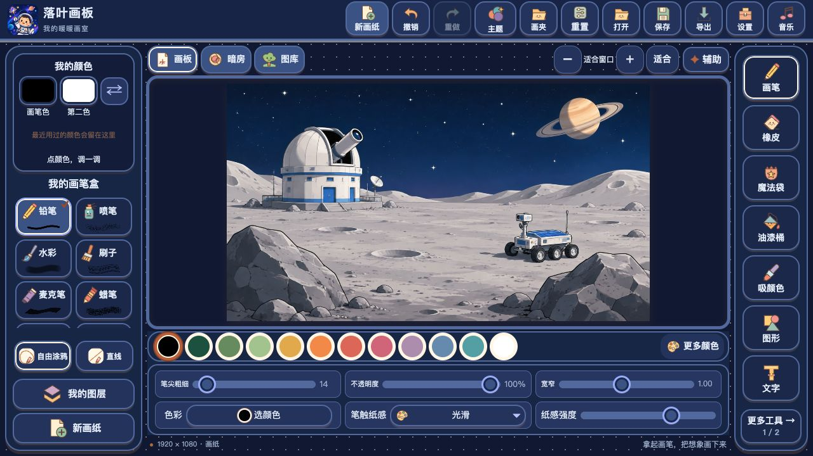
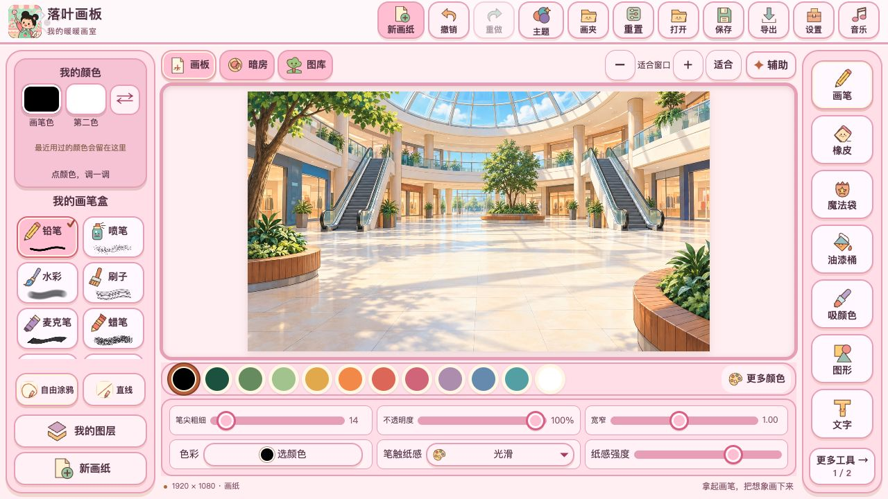

<p align="center">
  
</p>

<h1 align="center">Luoye Artboard · 落叶画板</h1>

<p align="center"><strong>A little painting studio for big imaginations.</strong></p>

<p align="center">Draw, color, and build little worlds with an offline desktop painting app for children.</p>

<p align="center">
  <a href="README.md">简体中文</a> ·
  <a href="#getting-started">Get started</a> ·
  <a href="#features">Features</a> ·
  <a href="#system-requirements">System requirements</a> ·
  <a href="#build-from-source">Build</a>
</p>

## About Luoye

- **Start with a blank page or a landscape.** Choose a background, add characters, and make the scene your own
- **Explore at your own pace.** Illustrated tools, brush previews, and a warm color palette help children find their way around
- **Keep creating offline.** Artwork, drafts, the art library, and music stay on your device



## Features

From a blank page to a finished little scene, the brushes, gallery, drawing helpers, and save flow are designed to be easy to discover and try right away:

| | What you can do |
| --- | --- |
| **11 brushes** | Sketch with a pencil, spray soft dots, layer watercolor, or try a brush, marker, crayon, chalk, paint tube, star brush, rainbow brush, and two-color gradient brush. |
| **Drawing helpers and fill** | Use vertical, horizontal, four-way, or radial symmetry with guide lines. Closed-line fill colors an area without spilling out, while the shape eraser cuts star, heart, or cloud silhouettes. |
| **Paper, backgrounds, and coloring pages** | Start a picture in a forest, by a lake, on a farm, or in space; fill and paint themed coloring pages, or add paper grain to a brush. |
| **Gallery and animated characters** | Start with a colored background, stamp individual pictures, combine patterns, and add moving characters to a scene. |
| **Layers, shapes, text, and effects** | Move, resize, rotate, mirror, duplicate, and hide objects; draw shapes, add words, select and clone areas, and explore warps and image filters. |
| **Themes** | Switch the interface, buttons, dialogs, and logo between spring, summer, autumn, winter, mechanical, space, ocean, and candy themes. The canvas and artwork stay unchanged, and the last choice is remembered. |
| **Save and share** | Save editable projects, recover local drafts, import pictures, and export artwork as PNG or JPEG. |
| **Music and multi-platform use** | Draw along to 20 built-in MIDI tracks, adjust music and tool sound volumes separately, and use the app offline on macOS, Windows, Android, iPhone, or iPad. The Web version runs directly in a browser. |

| <div align="center"><strong>Spring · Forest background</strong></div> | <div align="center"><strong>Mechanical · City background</strong></div> |
| --- | --- |
|  |  |
| <div align="center"><strong>Space · Space background</strong></div> | <div align="center"><strong>Candy · Mall background</strong></div> |
|  |  |

## Getting started

1. Open [Releases](https://github.com/zxxf18/luoye-artboard/releases) and choose the package for your system
2. Launch Luoye Artboard and start with a blank page, or choose **Gallery → Colored backgrounds** to set a scene
3. Pick a brush or open the magic bag. Save your project to keep editing, or export an image to share

The current interface is in Simplified Chinese. See the [build guide](docs/build.md) to run the editor from source

## System requirements

### macOS

- macOS 13 or later
- Apple Silicon (arm64)

### Windows

- Windows 10 or Windows 11
- x64 architecture
- Microsoft Edge WebView2 Runtime
- .NET runtime bundled with the app
- .NET 10 Desktop Runtime required by the installer

### iPhone / iPad

- iOS 16 or later
- Universal app with iPhone and iPad portrait, landscape, and iPad split-view support
- Finger and Apple Pencil input; projects, images, and MIDI use the system Files picker
- The repository includes a buildable iOS target; device distribution still requires Xcode signing

## Build from source

### Editor and tests

- Node.js 22 or later

### macOS app

- macOS
- Xcode Command Line Tools with Swift 6
- macOS SDK

### iPhone / iPad app

- macOS with a full Xcode installation, including the iOS SDK and Simulator
- Xcode 16 or later

### Windows app

- .NET 10 SDK
- WebView2 x64 offline installer

### Windows installer

- A built Windows app
- .NET 10 SDK
- 7-Zip

```sh
npm test
npm run dev
```

Open `http://127.0.0.1:4173` for the browser preview. To package a desktop app, run the command for your target

```sh
npm run build:mac
# or
npm run build:windows
# or (requires full Xcode)
npm run build:ios
```

See the [build guide](docs/build.md) for tool paths and installer packaging

## macOS installation note

Without a paid Apple Developer membership, the macOS app is unsigned and unnotarized, so Gatekeeper may block it with a “damaged” message; that message alone does not establish file corruption

Download the package from this project's release page and compare its SHA-256 with the published value, replacing `{package_path}` with the downloaded file's path

```sh
shasum -a 256 "{package_path}"
```

After confirming a trusted source and a matching checksum, run this command and replace `{app_path}` with the extracted `.app` path

```sh
sudo xattr -rd com.apple.quarantine "{app_path}"
```

Then open the app again

If macOS says the app is from the internet, cannot be verified, or is unsafe, try opening it once more. Then go to System Settings → Privacy & Security and choose Open Anyway under Security

## Learn more

- [Documentation](docs/README.md)
- [Report an issue](https://github.com/zxxf18/luoye-artboard/issues)
- [License AGPLv3](LICENSE)
- [Donate](docs/donate.md)


## Link

- [Yebuluo](https://index.yebuluo.com.cn)
- [LinuxDo](https://linux.do)
